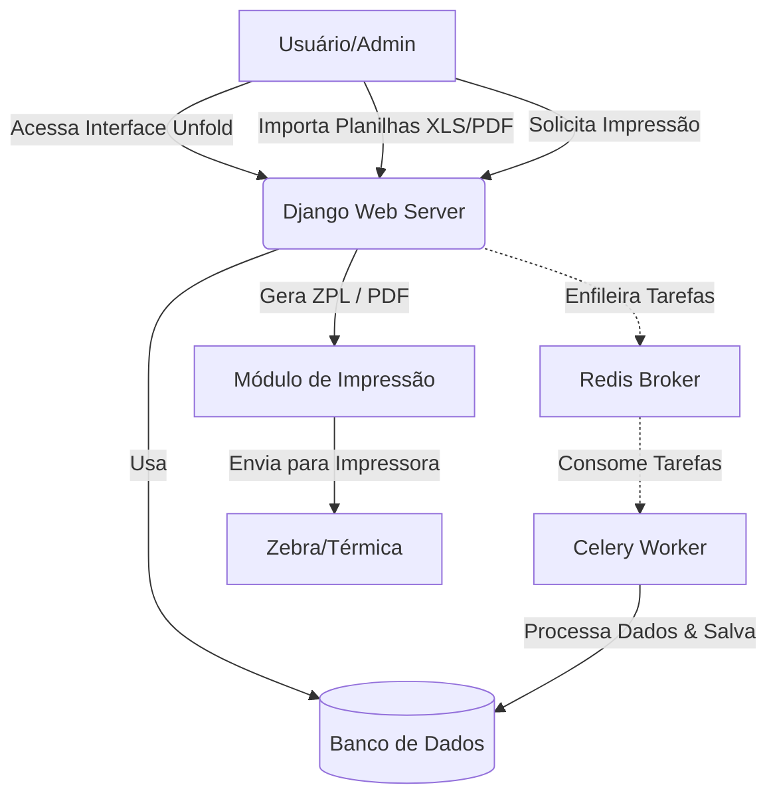

# Arquitetura do Sistema

O **Picking Ticket Printer System** é uma aplicação web construída com o framework Django (Python) para orquestrar pedidos de logística e imprimir romaneios em formato ZPL e PDF.

## Visão Geral

O sistema é responsável por:
1. **Importação de Dados**: Receber planilhas ou documentos PDFs contendo informações de pedidos, produtos e clientes.
2. **Processamento Assegurado**: Utilizar tarefas em background (Celery + Redis) para processar as importações sem bloquear a interface de usuário.
3. **Gerenciamento de Entidades**: Gerenciar clientes, endereços, produtos e pedidos através de uma área administrativa moderna (Django Unfold).
4. **Impressão Térmica e PDF**: Gerar etiquetas nos formatos ZPL nativo e PDF para impressoras térmicas via integração web.
5. **API RESTful**: Expor endpoints REST (via Django Rest Framework) documentados via OpenAPI estruturado no Swagger/Redoc.

## Tecnologias Principais

- **Backend**: Python 3.x, Django 6.0, Django Rest Framework.
- **Banco de Dados**: Configurado para SQLite via `.env` por padrão, facilmente intercambiável para PostgreSQL.
- **Tarefas Assíncronas**: Celery com Redis (broker/backend).
- **Interface e Tema**: Tailwind CSS via [Django Tailwind] com Tema Administrativo [Django Unfold].
- **Gerenciamento de Dependências**: Gerenciado nativamente (`pyproject.toml` com ferramenta como `uv`).

## Diagrama de Fluxo (Simplificado)

